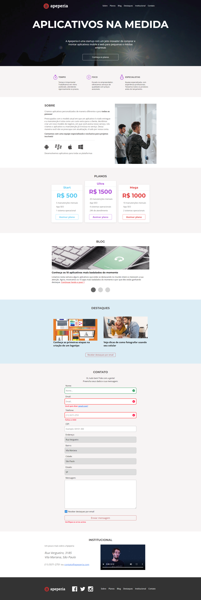

<h1 align="center"> Curso de Acessebilidade </h1>

  Projeto simples feito para Acessibilidade web.

 

  

## 🚀 Tecnologias

Esse projeto foi desenvolvido com as seguintes tecnologias:

- <strong>
     
      HTML
  </strong>
- <strong>
     
      CSS
  </strong>
- <strong>
      
      Javascript
  </strong>

## 💻 Projeto

- Melhorar o site para usuários de leitor de tela
- Como uma pessoa cega usa a internet
- Testar seu site usando o NVDA
- Detalhes no código podem impactar as pessoas
- Técnicas front-end que podem ajudar usuários
